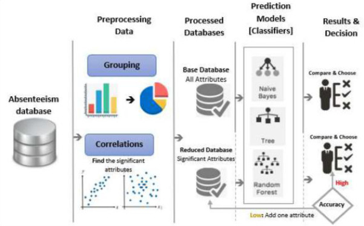
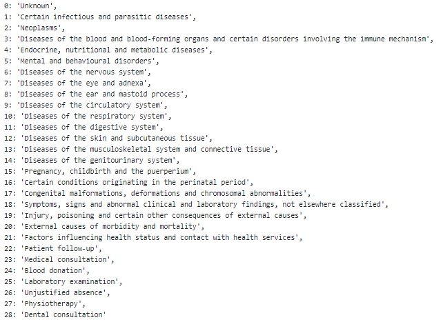

# Absenteeism_project 

> You can use my kaggle notebook for preview [>click here<](https://www.kaggle.com/miracle9to9/employee-absenteeism-predictions)

## *Classification based predictive model for absenteeism of employees 👔 at work*
I prepared an Interactive presentation just go through [Click-for-presentation](https://aniketpatils101.wixsite.com/website-4/presentation)

### Problem Statement:-
* Employees with low performance cause a vital lose for organizations and the absenteeism consider to be one of the factors that affect performance So, understanding the >causes of absenteeism may power the organization with a competitive advantages tool and open the area of research for computer and human resources fields.

* The aim of this analysis is to discover the factors and causes of employees absence using computerized technologies.

### Dataset:-
* Original dataset is available at https://archive.ics.uci.edu/ml/datasets/Absenteeism+at+work

* Cleaned dataset available [here](https://www.kaggle.com/miracle9to9/absenteeism-dataset)

Reasons listed in dataset are:

### Model:-
* At first time, I tried making predictions using regression model(RandomForest Regressor) as we want to predict no. of hours but R-2 Score was nearly equal to 0.
* Then I used RandomForest Classifier by making two classes of `Target Variable` '=<4' as '0' and '>4' as 1. 
* Applying hyperparameter tunning method such as `RandomSearchCV` and `GridSearchCV` resulted into **`77%`** accuracy with balanced precision and recall for both class.
* For testing purpose I tried to predict a class of single value extracted from testset also observed the contribution of each column for prediction.

### Insights/Conclusions :- 
* From this analysis company should predominantly focus on employees who are marking high absenteeism (represented with '>4' or class'1' in an analysis) which is major cause of business loss.
* Organisation can consider following points for improvement:-

  1. Arrange health camps as health issues are observed amongst employees
  2. Provide paid leaves, Encash leaves.
  3. Rented accomodation for employees who are living far.
  4. Grant excess compensation for overtime and more....

### Thank You....           
